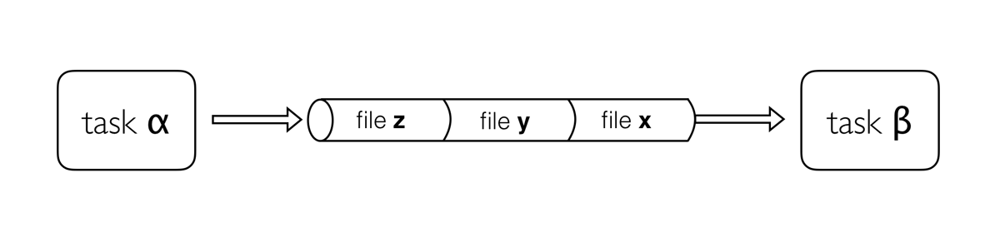

## Channels
Earlier we learnt that channels are the way in which Nextflow sends data around a workflow. Channels connect processes via their inputs and outputs. Channels can store multiple items, such as files (e.g., fastq files) or values. The number of items a channel stores determines how many times a process will run using that channel as input.
**Note: When the process runs using one item from the input channel, we will call that run a task.** 

## Why use Channels?
Channels are how Nextflow handles file management, allowing complex tasks to be split up, run in parallel, and reduces ‘admin’ required to get the right inputs to the right parts of the pipeline.



Channels are asynchronous, which means that outputs from a set of processes will not necessarily be produced in the same order as the corresponding inputs went in. However, the first element into a channel queue is the first out of the queue (First in - First out). This allows processes to run as soon as they receive input from a channel. Channels only send data in one direction, from a producer (a process/operator), to a consumer (another process/operator).

## Channel types
Nextflow distinguishes between two different kinds of channels: `queue channels` and `value channels`.

### Queue channel
Queue channels are a type of channel in which data is consumed (used up) to make input for a process/operator. Queue channels can be created in two ways:

1. As the outputs of a process.
2. Explicitly using channel factory methods such as `Channel.of` or `Channel.fromPath`.

#### DSL1
**In Nextflow DSL1 queue channels can only be used once in a workflow, either connecting workflow input to process input, or process output to input for another process. In DSL2 we can use a queue channel multiple times.**

### Value channels
The second type of Nextflow channel is a value channel. A value channel is bound to a single value. A value channel can be used an unlimited number times since its content is not consumed. This is also useful for processes that need to reuse input from a channel, for example, a reference genome sequence file that is required by multiple steps within a process, or by more than one process.

### Creating Channels using Channel factories
Channel factories are used to explicitly create channels. In programming, factory methods (functions) are a programming design pattern used to create different types of objects (in this case, different types of channels). They are implemented for things that represent more generalised concepts, such as a Channel.

Channel factories are called using the `Channel.<method>` syntax, and return a specific instance of a `Channel`.

### The value Channel factory
The value factory method is used to create a value channel. Values are put inside parentheses `()` to assign them to a channel.

For example:

```
ch1 = Channel.value( 'GRCh38' )
ch2 = Channel.value( ['chr1', 'chr2', 'chr3', 'chr4', 'chr5'] )
ch3 = Channel.value( ['chr1' : 248956422, 'chr2' : 242193529, 'chr3' : 198295559] )
```

1. Creates a value channel and binds a string to it.
2. Creates a value channel and binds a list object to it that will be emitted as a single item.
3. Creates a value channel and binds a map object to it that will be emitted as a single item.
T
he value method can only take `1` argument, however, this can be **a single list or map containing several elements**.

**Reminder**:
- A List object can be defined by placing the values in square brackets `[]` separated by a comma.
- A Map object is similar, but with `key:value` pairs separated by `commas`.

```
myList = [1776, -1, 33, 99, 0, 928734928763]
myMap = [ p1 : "start", q2 : "end" ]
```

## Queue channel factory
Queue (consumable) channels can be created using the following channel factory methods.

- Channel.of
- Channel.fromList
- Channel.fromPath
- Channel.fromFilePairs
- Channel.fromSRA

### The of Channel factory
When you want to create a channel containing multiple values you can use the channel factory `Channel.of`. `Channel.of` allows the creation of a queue channel with the values specified as arguments, separated by a `,`.

```
chromosome_ch = Channel.of( 'chr1', 'chr3', 'chr5', 'chr7' )
chromosome_ch.view()
chr1
chr3
chr5
chr7
```
The first line in this example creates a variable `chromosome_ch`. `chromosome_ch` is a queue channel containing the four values specified as arguments in the of method. The view operator will print one line per item in a list. Therefore the view operator on the second line will print four lines, one for each element in the channel:

You can specify a range of numbers as a single argument using the Groovy range operator `..`. This creates each value in the range (**including the start and end values**) as a value in the channel. The Groovy range operator can also produce ranges of dates, letters, or time. 

```
chromosome_ch = Channel.of(1..22, 'X', 'Y')
chromosome_ch.view()
```
Arguments passed to the of method can be of varying types e.g., combinations of numbers, strings, or objects. In the above examples we have examples of both string and number data types.

### Channel.from
You may see the method `Channel.from` in older nextflow scripts. This performs a similar function but is now deprecated (no longer used), and so `Channel.of` should be used instead.

#### Create a value and Queue and view Channel contents

1. Create a Nextflow script file called channel.nf .
2. Create a Value channel ch_vl containing the String 'GRCh38'.
3. Create a Queue channel ch_qu containing the values 1 to 4.
4. Use `.view()` operator on the channel objects to view the contents of the channels.

#### Solution
1. ch_vl = Channel.value('GRCh38')
2. ch_qu = Channel.of(1,2,3,4)
3. ch_vl.view()
4. ch_qu.view()

```
nextflow run channel.nf
N E X T F L O W  ~  version 21.04.0
Launching `channel.nf` [condescending_dalembert] - revision: c80908867b
 GRCh38
 1
 2
 3
 4
 ```


 ### The fromList Channel factory
You can use the Channel.fromList method to create a queue channel from a list object.

```
aligner_list = ['salmon', 'kallisto']
aligner_ch = Channel.fromList(aligner_list)
aligner_ch.view()
```
This would produce two lines.
```
salmon
kallisto
```

#### Channel.fromList vs Channel.of

In the above example, the channel has two elements. If you has used the `Channel.of`(aligner_list) it would have contained only 1 element [salmon, kallisto] and any operator or process using the channel would run once.

### The fromPath Channel factory
The previous channel factory methods dealt with sending general values in a channel. A special channel factory method `fromPath` is used when wanting to pass files.

The `fromPath` factory method creates a queue channel containing one or more files matching a file path.

The file path (written as a quoted string) can be the location of a single file or a “glob pattern” that matches multiple files or directories.

The file path can be a relative path (path to the file from the current directory), or an absolute path (path to the file from the system root directory - starts with /).

The script below creates a queue channel with a single file as its content.
```
read_ch = Channel.fromPath( 'data/yeast/reads/ref1_2.fq.gz' )
read_ch.view()
```
output
```
data/yeast/reads/ref1_2.fq.gz
```
You can also use glob syntax to specify pattern-matching behaviour for files. A glob pattern is specified as a string and is matched against directory or file names.

An asterisk, `*`, matches any number of characters (including none).
Two asterisks, `**`, works like `*` but will also search sub directories. This syntax is generally used for matching complete paths.
Braces `{}` specify a collection of subpatterns. For example: `{bam,bai}` matches “bam” or “bai”
For example the script below uses the *.fq.gz pattern to create a queue channel that contains as many items as there are files with .fq.gz extension in the data/yeast/reads folder.

```
read_ch = Channel.fromPath( 'data/yeast/reads/*.fq.gz' )
read_ch.view()
data/yeast/reads/ref1_2.fq.gz
data/yeast/reads/etoh60_3_2.fq.gz
data/yeast/reads/temp33_1_2.fq.gz
data/yeast/reads/temp33_2_1.fq.gz
data/yeast/reads/ref2_1.fq.gz
data/yeast/reads/temp33_3_1.fq.gz
```

You can change the behaviour of `Channel.fromPath` method by changing its options. A list of ``.fromPath` options is shown below.

Available `fromPath` options:

| Name  | Description |
| -------- | ------- |
| glob  | When true, the characters `*`, `?`, `[]` and `{}` are interpreted as glob wildcards, otherwise they are treated as literal characters (`default: true``)    |
| type  | The type of file paths matched by the string, either `file`, `dir` or `any` (default: `file`)     |
| hidden    | When true, hidden files are included in the resulting paths (`default: false`)    |
| maxDepth  | Maximum number of directory levels to visit (default: no limit) |
| followLinks | When true, symbolic links are followed during directory tree traversal, otherwise they are managed as files (`default: true`) |
| relative |	When true returned paths are relative to the top-most common directory (`default: false`) |
| checkIfExists	| When true throws an exception if the specified path does not exist in the file system (`default: false`) |

We can change the default options for the fromPath method to give an error if the file doesn’t exist using the `checkIfExists` parameter. In Nextflow, method parameters are separated by a `,` and parameter values specified with a colon `:`.

If we execute a Nextflow script with the contents below, it will run and not produce an output. This is likely not what we want.

```
read_ch = Channel.fromPath( 'data/chicken/reads/*.fq.gz' )
read_ch.view()
```

Add the argument `checkIfExists` with the value true.
```
read_ch = Channel.fromPath( 'data/chicken/reads/*.fq.gz', checkIfExists: true )
read_ch.view()
```
This will give an error as there is no data/chicken directory.
```
N E X T F L O W  ~  version 20.10.0
Launching `hello.nf` [intergalactic_mcclintock] - revision: d2c138894b
No files match pattern `*.fq.gz` at path: data/chicken/reads/
```

