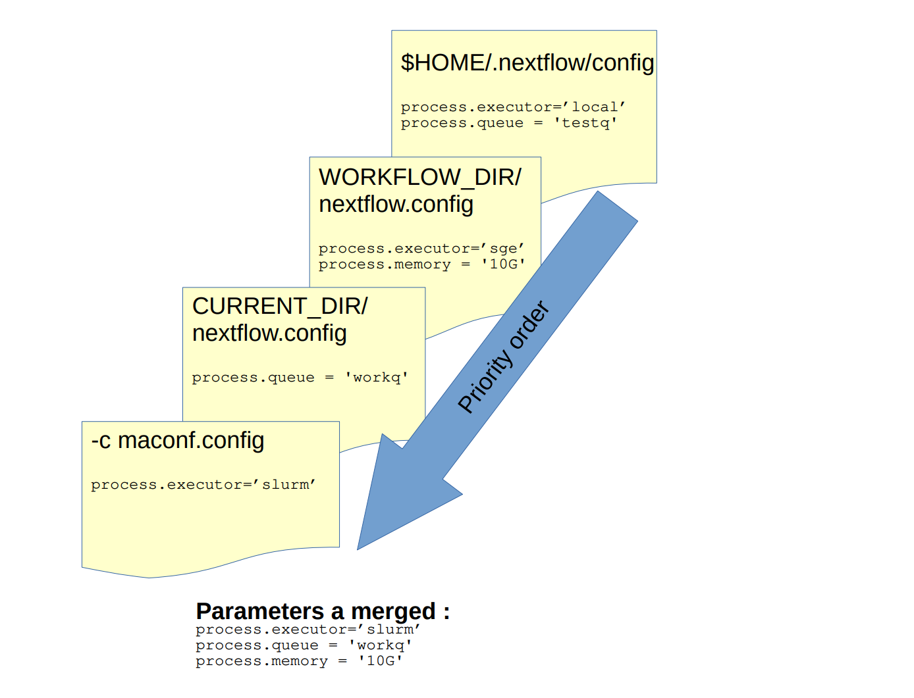

## Priority order of configs
There are different ways to configure nextflow execution : with configuration file or with profiles (defined in configuration).

### With config file
Nextflow looks for config in following order and only new params are loaded (ie the settings in the first override the same ones that may appear in the second one)

- in current directory (eg file created previously nextflow.config)
- in workflow directory (eg ~/.nextflow/assets/nextflow-io/rnaseq/nextflow.config)
- in home directory $HOME/.nextflow/config
- finally if config file is given with -c <config file> , the settings are considered as the first.




Configuration file example:

```
#scope by dot prefixing
process.executor = 'slurm'
process.queue = 'workq'
process.memory = '10G'

#scope using the curly brackets
singularity {
  enabled = true
  autoMount = true
}
```
### With profiles
Configuration files can contain the definition of one or more profiles. A profile is a set of configuration attributes that can be activated/chosen when launching a pipeline execution by using the `-profile` command line option.

```
profiles {

    standard {
        process.executor = 'local'
    }

    cluster {
        process.executor = 'slurm'
        process.queue = 'unlimitq'
        process.memory = '10GB'
    }
```